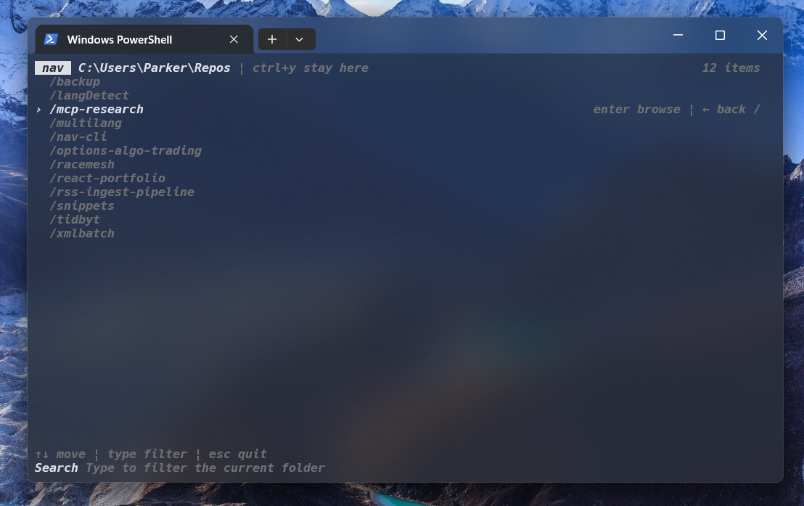

# nav-cli

`nav-cli` is a keyboard-first filesystem navigator for developers. Nav greatly improves the experience of navigating filesystems. It gives you a clean terminal UI for browsing directories, opening files, and copying your current working directory when you want to stay put. 

- **NPM**: [nav-cli](https://www.npmjs.com/package/nav-cli)
- **GitHub**: [nav-cli](https://github.com/parkersatterfield/nav-cli)
- **Product Hunt**: [nav-cli](https://www.producthunt.com/posts/nav-cli)



## ✨ Features
- **Cross-platform**: Works on Windows, macOS, and Linux in any shell.
- **Fast directory browsing**: Use arrow keys to move and `Enter` to browse deeper.
- **Editor picker**: Open files in VS Code, IntelliJ, or Notepad without hidden defaults.
- **Open current directory**: Press `Ctrl + O` to open the current folder in a supported editor.
- **Stay here flow**: Press `Ctrl + Y` to copy a ready-to-run `cd` command for the current directory.
- **Instant filtering**: Type at any time to narrow the current folder.
- **Clean terminal UI**: Slash-prefixed directories, plain files, and lightweight keyboard hints.

## 📦 Installation
```bash
npm i -g nav-cli
```


## 🛠️ Requirements
- **Node.js** (latest LTS recommended)
- **Editor Support**: VS Code, IntelliJ, or Notepad for file opening features


## 🚀 Usage
After installing globally via npm, run:

```bash
nav
```

You can also jump into saved entry modes:

```bash
nav h
nav f
```

From there you can:

- **Open Highlighted Target**: Press `Ctrl + O` to open the selected directory or file in your editor of choice.
- **Stay Here**: Copy a ready-to-run `cd` command for the current directory with `Ctrl + Y`.
- **Manage The Highlighted Target**: Press `Tab` to act on the selected item, including opening it or saving directories as home/favorites.
- **Back Directory**: Use the left arrow to move to the previous directory.
- **Directory Navigation**: Press `Enter` on a directory to browse into it.
- **File Opening**: Press `Enter` on a file and choose which editor to open it with.
- **Search**: Type at any time to filter the current folder.

If you run `nav h` without a saved home directory or `nav f` without saved favorites, nav falls back to your current directory and shows setup guidance in the interface.

### Hotkeys
- **Tab**: Open actions for the highlighted target.
- **Ctrl + o**: Open the highlighted target in a supported editor.
- **Ctrl + y**: Stay here and copy a `cd` command for the current directory.
- **Left Arrow**: Go back to the previous directory.
- **Enter**: Browse into a directory or open a file with an editor picker.
- **Arrow Keys**: Move through the list.
- **Escape**: Exit the application.


